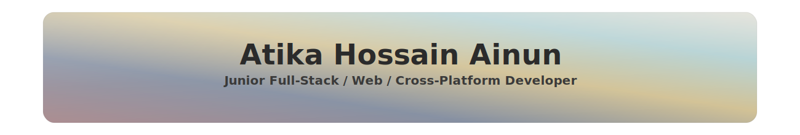

<!-- =========================================================
     Atika Hossain Ainun — Profile README
     Palette: ab8b8e, 8690a2, d2c296, b4d1d3, e0ded4
     ========================================================= -->

<!-- Feather-palette banner (responsive) -->

  

<!-- Bubbles divider (uses all 5 palette colors) -->

  <svg width="100%" height="64" viewBox="0 0 800 64" xmlns="http://www.w3.org/2000/svg" role="img" aria-label="bubbles divider">
    <line x1="16" y1="32" x2="784" y2="32" stroke="#e0ded4" stroke-width="1.5"/>
    <g opacity="0.9">
      <circle cx="80"  cy="32" r="9"  fill="#ab8b8e"/>
      <circle cx="130" cy="26" r="6"  fill="#8690a2"/>
      <circle cx="180" cy="36" r="11" fill="#d2c296"/>
      <circle cx="230" cy="28" r="7"  fill="#b4d1d3"/>
      <circle cx="280" cy="38" r="8"  fill="#e0ded4"/>
      <circle cx="520" cy="34" r="10" fill="#ab8b8e"/>
      <circle cx="570" cy="26" r="6"  fill="#8690a2"/>
      <circle cx="620" cy="36" r="11" fill="#d2c296"/>
      <circle cx="670" cy="28" r="7"  fill="#b4d1d3"/>
      <circle cx="720" cy="38" r="8"  fill="#e0ded4"/>
    </g>
  </svg>

---

### About me

I build practical, end-to-end web products and small tools. On the web side I work with **Next.js**, **Nest.js**, **Prisma**, and **PostgreSQL**. I also have hands-on experience with realtime features over **Socket.IO** and mobile UI in **Flutter**. I’m expanding my applied AI skills in **Python** and enjoy wiring ML features into product workflows when it improves the user experience.

<!-- Petal divider -->

  <svg width="100%" height="70" viewBox="0 0 820 70" xmlns="http://www.w3.org/2000/svg" role="img" aria-label="petal divider">
    <line x1="30" y1="35" x2="790" y2="35" stroke="#e0ded4" stroke-width="1.2"/>
    <g transform="translate(410,35)">
      <circle r="5.5" fill="#ab8b8e"/>
      <ellipse rx="14" ry="5" fill="#ffd6e0" transform="rotate(0)"/>
      <ellipse rx="14" ry="5" fill="#b4d1d3" transform="rotate(45)"/>
      <ellipse rx="14" ry="5" fill="#d2c296" transform="rotate(90)"/>
      <ellipse rx="14" ry="5" fill="#8690a2" transform="rotate(135)"/>
    </g>
  </svg>

---

### Tech I use

**Development Core**

**AI/ML**

<!-- Bubbles divider -->

  <svg width="100%" height="64" viewBox="0 0 800 64" xmlns="http://www.w3.org/2000/svg" role="img" aria-label="bubbles divider">
    <line x1="16" y1="32" x2="784" y2="32" stroke="#e0ded4" stroke-width="1.5"/>
    <g opacity="0.9">
      <circle cx="90"  cy="32" r="9"  fill="#8690a2"/>
      <circle cx="140" cy="26" r="6"  fill="#ab8b8e"/>
      <circle cx="190" cy="36" r="11" fill="#b4d1d3"/>
      <circle cx="240" cy="28" r="7"  fill="#d2c296"/>
      <circle cx="290" cy="38" r="8"  fill="#e0ded4"/>
      <circle cx="510" cy="34" r="10" fill="#8690a2"/>
      <circle cx="560" cy="26" r="6"  fill="#ab8b8e"/>
      <circle cx="610" cy="36" r="11" fill="#b4d1d3"/>
      <circle cx="660" cy="28" r="7"  fill="#d2c296"/>
      <circle cx="710" cy="38" r="8"  fill="#e0ded4"/>
    </g>
  </svg>

---

### Recent projects

- **Yummunity Blog** — full-stack food platform  
  *Next.js, React Query, SCSS/Bulma · Nest.js, Prisma, PostgreSQL*  
  Browse recipes and share your own; clean UI + typed backend and ORM.  
  [`/Yummunity-blog`](https://github.com/ainun-11/Yummunity-blog)

- **Scribbler-Realtime** — tiny realtime event relay  
  *Node.js, Express, Socket.IO; health-check endpoint*  
  Drop-in backend for collaborative canvases or cursors.  
  [`/scribbler-realtime`](https://github.com/ainun-11/scribbler-realtime)

- **TravelStay Bangladesh** — Flutter travel/stay UI  
  *Dart (Flutter) with Android/iOS scaffolding*  
  [`/travelstay-bangladesh`](https://github.com/ainun-11/travelstay-bangladesh)

<!-- Petal divider -->

  <svg width="100%" height="70" viewBox="0 0 820 70" xmlns="http://www.w3.org/2000/svg" role="img" aria-label="petal divider">
    <line x1="30" y1="35" x2="790" y2="35" stroke="#e0ded4" stroke-width="1.2"/>
    <g transform="translate(410,35)">
      <circle r="5.5" fill="#8690a2"/>
      <ellipse rx="14" ry="5" fill="#e0ded4" transform="rotate(0)"/>
      <ellipse rx="14" ry="5" fill="#ab8b8e" transform="rotate(45)"/>
      <ellipse rx="14" ry="5" fill="#b4d1d3" transform="rotate(90)"/>
      <ellipse rx="14" ry="5" fill="#d2c296" transform="rotate(135)"/>
    </g>
  </svg>

---

### Contact

  
  
  

<!-- Footer bubble divider -->

  <svg width="100%" height="64" viewBox="0 0 800 64" xmlns="http://www.w3.org/2000/svg" role="img" aria-label="bubbles divider">
    <line x1="16" y1="32" x2="784" y2="32" stroke="#e0ded4" stroke-width="1.5"/>
    <g opacity="0.9">
      <circle cx="70"  cy="32" r="9"  fill="#e0ded4"/>
      <circle cx="120" cy="26" r="6"  fill="#b4d1d3"/>
      <circle cx="170" cy="36" r="11" fill="#d2c296"/>
      <circle cx="220" cy="28" r="7"  fill="#8690a2"/>
      <circle cx="270" cy="38" r="8"  fill="#ab8b8e"/>
      <circle cx="530" cy="34" r="10" fill="#e0ded4"/>
      <circle cx="580" cy="26" r="6"  fill="#b4d1d3"/>
      <circle cx="630" cy="36" r="11" fill="#d2c296"/>
      <circle cx="680" cy="28" r="7"  fill="#8690a2"/>
      <circle cx="730" cy="38" r="8"  fill="#ab8b8e"/>
    </g>
  </svg>

